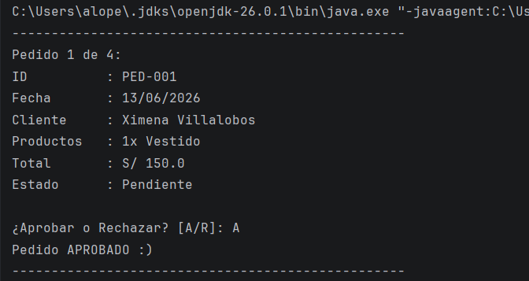

# Área: Comercio Electrónico - Grupo 05
# Gestión de Pedidos por ID - Patrón Iterator

Este proyecto implementa el **Patrón de Diseño Iterator** para gestionar, evaluar y ordenar una lista de pedidos de forma automatizada, desacoplando la estructura de almacenamiento de la lógica de recorrido.

## Funcionamiento del Recorrido e Intercambio Interno

El sistema oculta la estructura de datos interna del arreglo mediante la abstracción del patrón. La clase principal interactúa de manera directa con la colección usando interfaces abstractas, delegando la responsabilidad del recorrido.

* **Criterio de Búsqueda y Orden:** El recorrido no se realiza de forma aleatoria. Se basa estrictamente en el **identificador correlativo (ID) del pedido** de manera alfabética ascendente.
* **Mecanismo de Intercambio (Bubble Sort):** Para garantizar que el iterador entregue los datos en orden, cada vez que se invoca el método `add()`, la colección reestructura internamente las posiciones del arreglo. Utiliza el método `compareTo()` para evaluar las cadenas de texto: si el ID de la posición actual es alfabéticamente mayor que el de la posición siguiente, se ejecuta un intercambio físico de posiciones (un *swap*) apoyado en una variable auxiliar. Esto desplaza los identificadores mayores hacia los índices finales del arreglo antes de iniciar cualquier lectura.
* **Control de Punteros:** La clase `ArrayIterator` administra un índice interno llamado `posicion`. El método `hasNext()` evalúa que el puntero no exceda el límite físico asignado y que la casilla contenga un objeto válido (distinto de nulo). El método `next()` extrae secuencialmente el objeto del índice actual e incrementa la variable en más uno.

## Condición para la toma de decisión de Estado de Pedido

El sistema evalúa el impacto financiero del pedido en el momento exacto de su inserción, aplicando la condición para tomar **La Decisión Final del Estado de Pedido** sobre el atributo de precio total:

* **Monto menor o igual a S/ 500.00:** Invocará el método `aprobar()`, cambiando el estado interno del objeto a "Aprobado".
* **Monto mayor a S/ 500.00:** Invocará el método `rechazar()`, cambiando el estado interno del objeto a "Rechazado".

## Salida Esperada

Al procesar la colección, el flujo de ejecución arroja la interfaz en consola estructurada para cada elemento recuperado:

* **Efectividad del Ordenamiento:** El programa despliega el "Pedido 1 de 4" mostrando el identificador `PED-001`. Esto demuestra que el algoritmo de ordenamiento por **Bubble sort** funcionó correctamente en la colección interna, dado que los datos de prueba iniciales se ingresaron en desorden (`PED-003` fue el primero insertado en el constructor).
* **Evaluación del Filtro Financiero:** Al procesar un pedido de S/ 150.0, el sistema infiere la aceptación mediante la sugerencia automática `[A/R]: A`. La lógica interna confirma la validez de la regla eligiendo la decisión de éxito `Pedido APROBADO :)`, validando que el valor se encuentra por debajo del umbral de riesgo de S/ 500.00 establecido en los requisitos.
